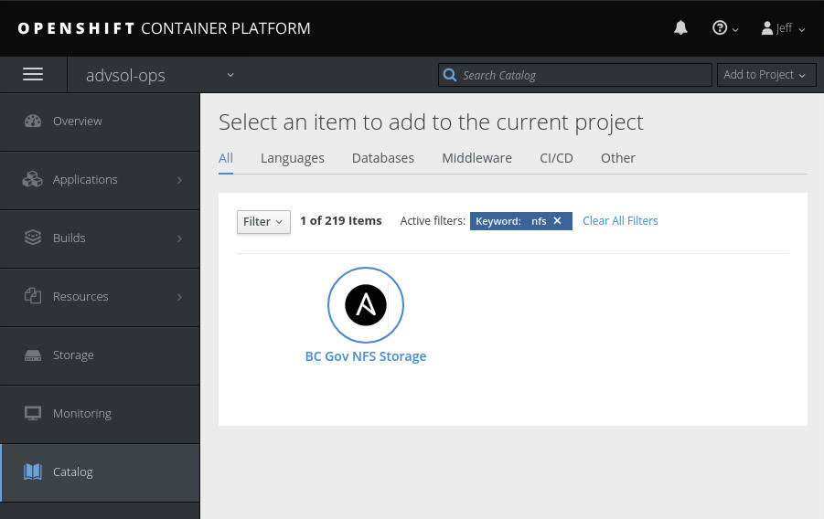
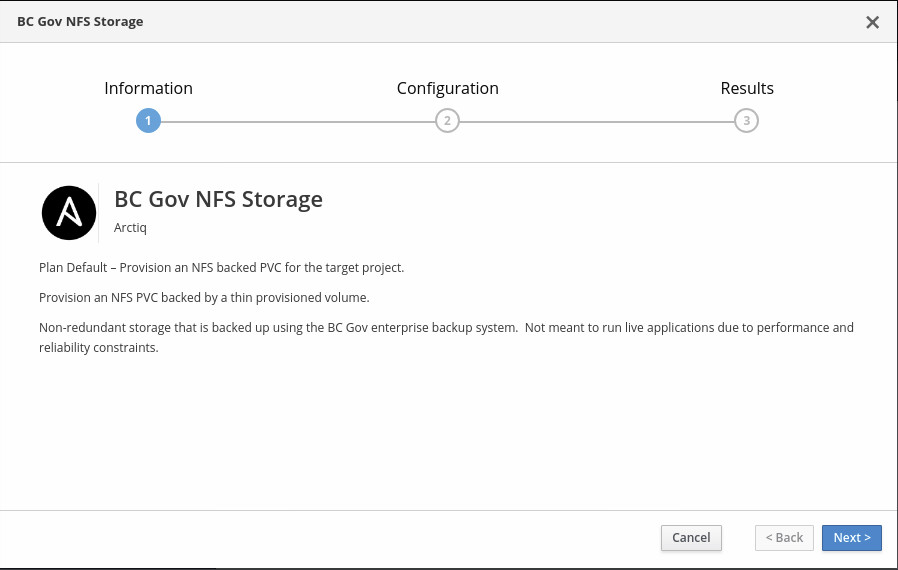
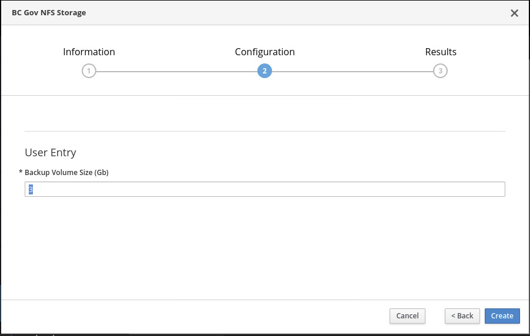
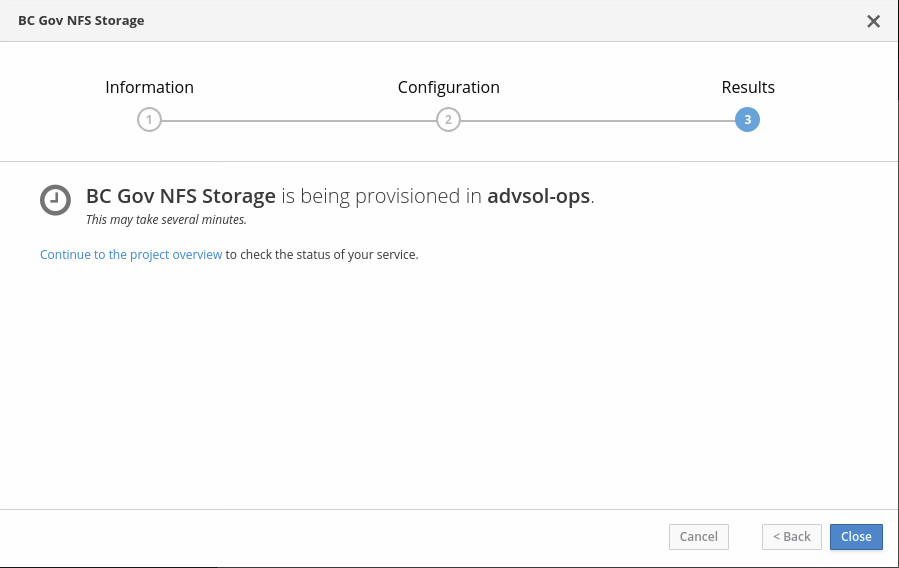
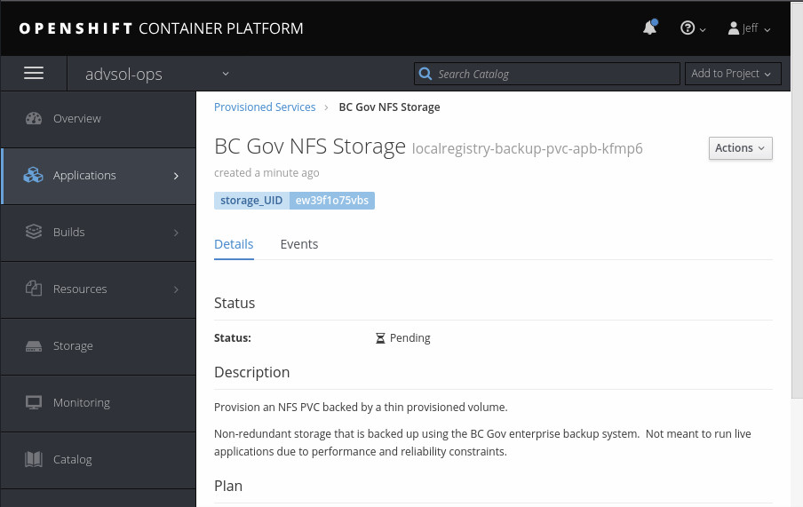
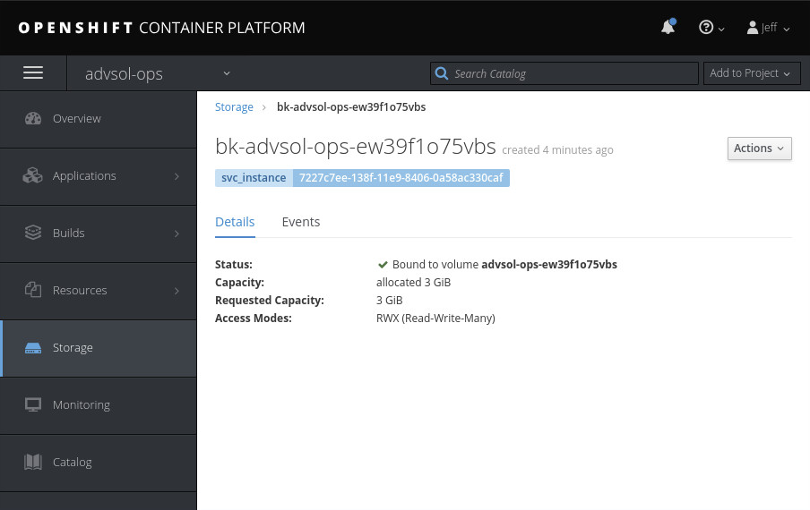

# GUI provisioning walkthrough

1. Open Catalog page within project and filter output

2. Walkthrough the wizard and enter the size requested (in GB)

3. Check ServiceInstance for ansyncronous provisioning (this may take a few minutes
while the storage and filesystem is created)

4. Once the ServiceInstance has completed provisioning you can see your PVC.

